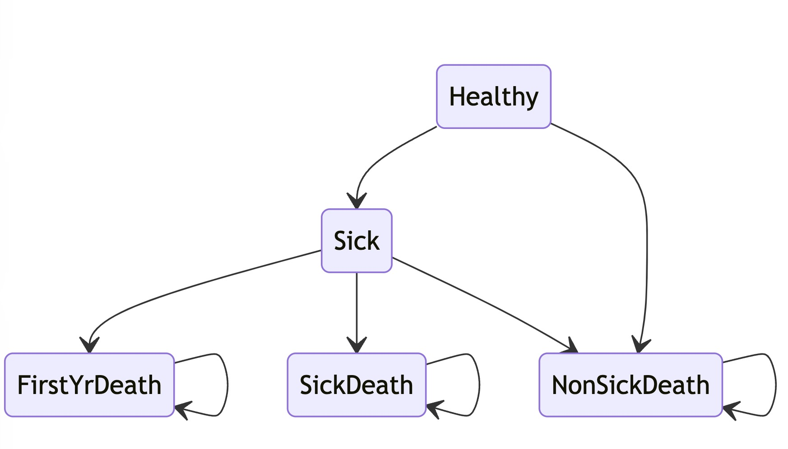

The cause(CVD)-deleted life table is obtained from the nonCVD_life_table.R.

```{r setup}
knitr::opts_chunk$set(warning = FALSE)
knitr::opts_chunk$set(message = FALSE)
library(tidyverse)
library(knitr)
library(kableExtra)
library(survival)
library(flexsurv)
library(haven)
library(dampack)
library(Matrix)
source("nonCVD_life_table.R")
source("functions_markov.R")
options("scipen"=1000, "digits"=8)
```

```{r func, include=FALSE}
ProbToRate = function(prob, t){
  -log(1-prob)/t
}

RateToProb = function(rate, t){
  1 - exp(-rate*t)
}
```

-   Assume the cohort we're working on starts as 55-year-old men in United States.
-   Assume a 3% discount rate & 10-year time horizon.

# Step 1: Healthy-Sick-Death

Assume r_HS = 0.1, hr_HS_trt = 0.5.

```{r params}
params_sc <- list(
  n_age_init = 55,
  n_age_max = 65,
  d_c = 0.03,
  d_e = 0.03, 
  n_sim = 1000,
  r_HS = 0.1,
  hr_S = 1.9, # hazard ratio on rate
  # overall death
  # p_HD is the time-varying background mortality
  # p_SD is the time-varying background mortality * 1.9(Hazard Ratio)
  hr_HS_trt = 0.5,
  u_H = 1,
  u_S = 0.773,
  u_D = 0,
  c_H = 8494, # Non-CVD health care cost
  c_trt = 840,
  c_S = 3917 + 8494, # Cost of annual follow-up post ASCVD
  c_nonfatal_firstYr = 49348,
  c_fatal_firstYr = 16760,
  c_D = 0,
  cycle_length = 1,
  n_cycles = 10
)

v_names_states = c("Healthy", "Sick", "Death")
n_states = length(v_names_states)
v_names_str = c("quo","trt")
n_strategies = length(v_names_str)
```

Get the gompertz models for pHS and pSD separately from the cause-deleted life table.

```{r life-table-gompertz}
# mltNonCVD_long = data.frame(Age = rep(NA, ceiling(sum(mlt2020_nonCVD$dx))), Death = rep(1, ceiling(sum(mlt2020_nonCVD$dx))))
# 
# start = 1
# for (age in 0:(nrow(mlt2020_nonCVD)-1)) {
#   n_row = round(mlt2020_nonCVD[age+1,"dx"])
#   mltNonCVD_long[seq(start,(n_row + start - 1)),"Age"] = age
#   start = start + n_row
# }
# 
# mltNonCVD_long = mltNonCVD_long %>% drop_na()
# 
# parameters_m = data.frame(
#   Age = mlt2020_nonCVD$Age,
#   shape=rep(NA,nrow(mlt2020_nonCVD)),
#   rate=rep(NA,nrow(mlt2020_nonCVD)))
# 
# 
# for (age in 0:nrow(mlt2020_nonCVD)-1) {
#   surv.data <- with(mltNonCVD_long[mltNonCVD_long$Age >= age,], Surv(Age, Death, origin=age))
#   surv.model <- flexsurvreg(surv.data ~ 1, dist="gompertz")
#   
#   parameters_m$shape[age+1] <- surv.model$coefficients[1]
#   parameters_m$rate[age+1] <- exp(surv.model$coefficients[2])
# }
# 
# # start since 45-yr
# # pgompertz(cycle, parameters_m$shape[46], parameters_m$rate[46])
# 
# mlt2020_hr = data.frame(Age = 0:(nrow(mlt2020_nonCVD)-1), qx = sapply(sapply(mlt2020_nonCVD$qx, ProbToRate, t = 1) * params_sc$hr_S, RateToProb, t = 1), lx = rep(0,nrow(mlt2020_nonCVD)), dx = rep(NA,nrow(mlt2020_nonCVD)))
# 
# mlt2020_hr[1,"lx"] = 100000
# 
# for (i in 1:nrow(mlt2020_hr)) {
#   if (mlt2020_hr[i, "lx"] > 0) {
#     mlt2020_hr[i, "dx"] = round(mlt2020_hr[i, "qx"] * mlt2020_hr[i, "lx"])
#     mlt2020_hr[i+1, "lx"] = mlt2020_hr[i, "lx"] - mlt2020_hr[i, "dx"]
#   }
# }
# mlt2020_hr  = mlt2020_hr %>% filter(!is.na(dx))
# 
# mltHr_long = data.frame(Age = rep(NA, 100000), Death = rep(1, 100000))
# 
# start = 1
# for (age in 0:(nrow(mlt2020_hr)-1)) {
#   n_row = mlt2020_hr[age+1,"dx"]
#   mltHr_long[seq(start,(n_row + start - 1)),"Age"] = age
#   start = start + n_row
# }
# 
# parameters_m_hr = data.frame(
#   Age = mlt2020_hr$Age,
#   shape=rep(NA,nrow(mlt2020_hr)),
#   rate=rep(NA,nrow(mlt2020_hr)))
# 
# for (age in 0:nrow(mlt2020_hr)-1) {
#   surv.data <- with(mltHr_long[mltHr_long$Age >= age,], Surv(Age, Death, origin=age))
#   surv.model <- flexsurvreg(surv.data ~ 1, dist="gompertz")
#   
#   parameters_m_hr$shape[age+1] <- surv.model$coefficients[1]
#   parameters_m_hr$rate[age+1] <- exp(surv.model$coefficients[2])
# }
# 
# save(parameters_m, parameters_m_hr, file = "life table/MarkovCVD_gompertz.RData")

load("life table/MarkovCVD_gompertz.RData")
```

```{r matrix&payoff}
# probability transition matrix
m_R = list()
m_R$quo = matrix(c(-params_sc$r_HS, 0, 0,
                   params_sc$r_HS, 0, 0,
                   0, 0, 0), ncol = 3, dimnames = list(v_names_states, v_names_states))

m_R$trt = matrix(c(-params_sc$r_HS*params_sc$hr_HS_trt, 0, 0,
                   params_sc$r_HS*params_sc$hr_HS_trt, 0, 0,
                   0, 0, 0), ncol = 3, dimnames = list(v_names_states, v_names_states))

m_P = lapply(lapply(m_R, expm),as.matrix)

m_P

payoffs = list()
payoffs$quo = matrix(c(params_sc$c_H, params_sc$u_H, params_sc$c_S, params_sc$u_S, params_sc$c_D, params_sc$u_D), ncol = n_states, dimnames = list(c("costs", "qalys"), v_names_states))
payoffs$trt = matrix(c(params_sc$c_H + params_sc$c_trt, params_sc$u_H, params_sc$c_S, params_sc$u_S, params_sc$c_D, params_sc$u_D), ncol = n_states, dimnames = list(c("costs", "qalys"), v_names_states))

payoffs

```

Here the loop is written forcely.\
Wait for a better choice!

```{r markov-traces}
l_m_M = list()

for (i in 1:n_strategies) {
  #initialization
  l_m_M[[v_names_str[i]]] = 
    matrix(0, nrow = params_sc$n_cycles+1, ncol = n_states, 
           dimnames = list(0:(params_sc$n_cycles), v_names_states))
  l_m_M[[v_names_str[i]]][1,] = c(1, rep(0, times = n_states-1))
  
  for (cycle in 1:params_sc$n_cycles) {
    l_m_M[[v_names_str[i]]][cycle+1,] = l_m_M[[v_names_str[i]]][cycle,] %*% m_P[[v_names_str[i]]]
    
    # hazard ratio for all kinds of death
    # l_m_M[[v_names_str[i]]][cycle+1,"Sick"] = l_m_M[[v_names_str[i]]][cycle+1,"Sick"] - l_m_M[[v_names_str[i]]][cycle,"Sick"] * (pgompertz(cycle, parameters_m_hr$shape[params_sc$n_age_init + 1], parameters_m_hr$rate[params_sc$n_age_init + 1]) - pgompertz(cycle-1, parameters_m_hr$shape[params_sc$n_age_init + 1], parameters_m_hr$rate[params_sc$n_age_init + 1])) - l_m_M[[v_names_str[i]]][cycle+1,"Healthy"] * m_P[[v_names_str[i]]]["Healthy","Sick"] * (pgompertz(cycle, parameters_m$shape[params_sc$n_age_init + 1], parameters_m$rate[params_sc$n_age_init + 1])-pgompertz(cycle-1, parameters_m$shape[params_sc$n_age_init + 1], parameters_m$rate[params_sc$n_age_init + 1])) / m_P[[v_names_str[i]]]["Healthy", "Healthy"]
    l_m_M[[v_names_str[i]]][cycle+1,"Sick"] = l_m_M[[v_names_str[i]]][cycle,"Sick"]*(1 - (pgompertz(cycle, parameters_m_hr$shape[params_sc$n_age_init + 1], parameters_m_hr$rate[params_sc$n_age_init + 1]) - pgompertz(cycle-1, parameters_m_hr$shape[params_sc$n_age_init + 1], parameters_m_hr$rate[params_sc$n_age_init + 1]))) + l_m_M[[v_names_str[i]]][cycle,"Healthy"] * m_P[[v_names_str[i]]]["Healthy","Sick"] * (1 - (pgompertz(cycle, parameters_m$shape[params_sc$n_age_init + 1], parameters_m$rate[params_sc$n_age_init + 1])-pgompertz(cycle-1, parameters_m$shape[params_sc$n_age_init + 1], parameters_m$rate[params_sc$n_age_init + 1])))
    
    
    # background mortality
    l_m_M[[v_names_str[i]]][cycle+1,"Healthy"] = l_m_M[[v_names_str[i]]][cycle+1,"Healthy"] * (1-pgompertz(cycle, parameters_m$shape[params_sc$n_age_init + 1], parameters_m$rate[params_sc$n_age_init + 1])+ pgompertz(cycle-1, parameters_m$shape[params_sc$n_age_init + 1], parameters_m$rate[params_sc$n_age_init + 1]))
    
    l_m_M[[v_names_str[i]]][cycle+1,"Death"] = 1 - l_m_M[[v_names_str[i]]][cycle+1,"Healthy"] - l_m_M[[v_names_str[i]]][cycle+1,"Sick"]
  }
}

l_m_M
```

```{r discount}
get_ce = function(l_m_M, payoffs, params){
  v_dwc  <- 1 / ((1 + (params$d_c * params$cycle_length)) ^ (0:params$n_cycles))
  v_dwe  <- 1 / ((1 + (params$d_e * params$cycle_length)) ^ (0:params$n_cycles))
  ## Within-cycle correction (WCC) using Simpson's 1/3 rule ----
  # Function included in "Functions_markov.R"
  v_wcc <- gen_wcc(n_cycles = params$n_cycles,
                 method = "Simpson1/3") # vector of wcc
  
  v_tot_qaly <-
    map2(l_m_M, payoffs,~({
      v_u_str <- .y["qalys",v_names_states] %>% as.vector()
      t(.x[,v_names_states] %*% v_u_str) %*% (v_dwe * v_wcc)
    })) %>%
    unlist()

  v_tot_cost <-
    map2(l_m_M, payoffs,~({
      v_c_str <- .y["costs",v_names_states] %>% as.vector()
      t(.x[,v_names_states] %*% v_c_str) %*% (v_dwc * v_wcc)
    })) %>%
    unlist()
  
  ce=list()
  ce[["discounted_weight_of_cost"]] = v_dwc
  ce[["discounted_weight_of_qaly"]] = v_dwe
  ce[["Within_cycle_correction"]] = v_wcc
  ce[["cost"]] = v_tot_cost
  ce[["qaly"]] = v_tot_qaly
  
  ce
}

tot_ce = get_ce(l_m_M, payoffs, params = params_sc)
tot_ce

```

```{r ICERs}
df_cea <- calculate_icers(cost       = tot_ce$cost,
                          effect     = tot_ce$qaly,
                          strategies = v_names_str)
df_cea

table_cea <- format_table_cea(df_cea) 
table_cea

## CEA frontier -----
# depends on the `ggplot2`  and `ggrepel` packages.
# Function included in "Functions_markov.R"
plot(df_cea, label = "all", txtsize = 16) +
  expand_limits(x = max(table_cea$QALYs) + 0.1) +
  theme(legend.position = c(0.8, 0.2))
```
